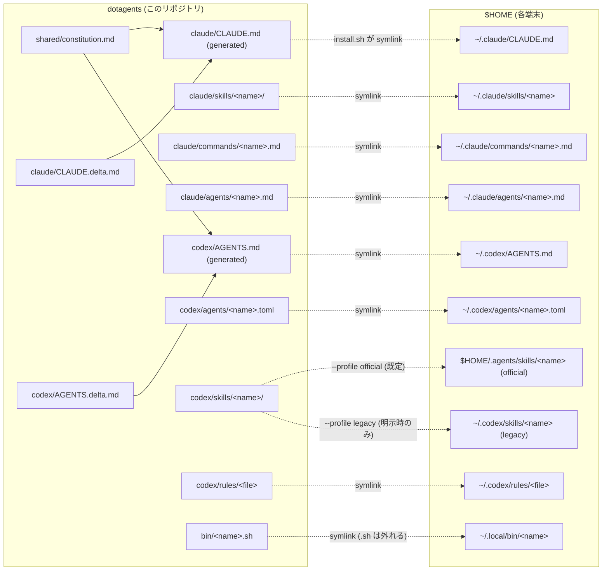

# dotagents

Claude Code / Codex の環境そのもの（skill・command・agents・rule・グローバル共通憲法・調査資産・環境整備の聖典）を**複数端末で同期する個人 dotfiles**。GitHub が真実の源（罠DBは v0.15+ で Caveat 自身が dotagents 外で管理）。

- **趣旨・原則・残件**: [PLAN.md](PLAN.md)（憲章＝聖典 v4。プランは docs/ で TODO を兼ねる）
- **AI 向けの掟（全エージェント共通）**: [AGENTS.md](AGENTS.md)（Claude は [CLAUDE.md](CLAUDE.md) が `@AGENTS.md` で取り込む）。**URL を渡された AI のオンボーディング入口も AGENTS.md**（「AI オンボーディング」節）

## 構成

```
dotagents/
├── PLAN.md              … 開発工場の憲章（趣旨・原則・定常運用・残件）
├── AGENTS.md            … 全 AI 共通のプロジェクト正典＋AI オンボーディング入口
├── CLAUDE.md            … Claude 用の薄いラッパ（@AGENTS.md ＋ ベル固有）
├── install.sh           … symlink 配置（冪等・実ファイルは SKIP・失敗は停止）
├── docs/                … 00_overview.md（地図）・02_models.md（役割→モデル対応表）・01_project-layout.md・進行中プラン／archive/（役目を終えた文書）
├── rag/                 … 調査・研究の再利用棚（INDEX.md＋topic/raw/ 一次ソース）
├── shared/
│   └── constitution.md  … Claude/Codex共通憲法の唯一の手編集正本
├── claude/
│   ├── CLAUDE.delta.md  … Claude固有差分の正本
│   ├── CLAUDE.md        … 共通＋deltaの生成物（→ ~/.claude/CLAUDE.md）
│   ├── skills/          … → ~/.claude/skills/<name>
│   ├── commands/        … → ~/.claude/commands/<name>.md
│   └── agents/          … → ~/.claude/agents/<name>.md
├── codex/
│   ├── AGENTS.delta.md  … Codex固有差分の正本
│   ├── AGENTS.md        … 共通＋deltaの生成物（→ ~/.codex/AGENTS.md）
│   ├── agents/          … → ~/.codex/agents/<name>.toml
│   ├── skills/          … → $HOME/.agents/skills/<name>（既定。legacy は明示指定）
│   └── rules/           … → ~/.codex/rules/<file>
└── bin/                 … → ~/.local/bin/<name>（.sh / .mjs は外れる。実行言語は shebang）
```



Codex skill は同一端末・同一入口で **official / legacy の一方だけ**に置く。既定は公式 user skill 面
`$HOME/.agents/skills`。古い入口の互換検証だけ `./install.sh --profile legacy` を明示し、
`verify-install --profile legacy` を通す。installer は反対面を勝手に削除しない。

## 同梱資産

| 種類 | 名前 | 用途 |
|---|---|---|
| Claude skill | `orchestrate` | 共有Control lifecycle／委譲契約を読み、Claude固有status projectionとWorkflow appendixを使う入口 |
| Codex skill | `orchestrate` | 共有Control lifecycle／委譲契約を読み、native・外部実行・相談レーンを裁定する製品固有入口 |
| 共有契約 | `shared/orchestrate/{contract,delegation-contract}.md` | 両skillのuse-not-use、Control lifecycle、製品中立のDelegation Packet／Worker Reportの唯一の正本 |
| Claude skill | `auto-deploy-on-push` | push 契機の SSH + docker compose 自動デプロイ構築 |
| Codex skill | `auto-deploy-on-push` | read-only調査とH承認を先行するpush起点デプロイ構築 |
| Claude agent | `implementer` | 委譲契約焼き込み済みの実装者（安価枠。対応表は docs/02_models.md） |
| Claude agent | `refuter` | 敵対的検証者（読み取り専用） |
| Claude command | `auto-deploy-on-push` / `polish-github` | 各スキルの入口 |
| Codex skill | `polish-github` | GitHub presentation 整備（正本は Claude 版・Codex 版は薄いポインタ＝一本化済み） |
| Codex rule | `default.rules` | Codex 常時適用ルール |
| 共通憲法 | `shared/constitution.md` | Claude／Codexへ生成する人格・応対・安全・調査・計画・git・報告の唯一の共通正本 |
| Claudeグローバル規範 | `claude/CLAUDE.delta.md` → `claude/CLAUDE.md` | 共通憲法＋Claude delta（2026-07-16現在は空）から合成する配布生成物 |
| Codexグローバル規範 | `codex/AGENTS.delta.md` → `codex/AGENTS.md` | 共通憲法＋Codex delta（2026-07-16現在は空。配置・配線の正典はdocs/02・docs/05）から合成する配布生成物 |
| bin | `render-global-constitution.mjs` | 共通憲法＋host deltaから両runtime向け完全指示を冪等生成し、driftを検査 |
| Codex サブエージェント | `codex/agents/{implementer,refuter,sorter}.toml` | ネイティブ委譲のrole定義（役割→model×effortの正は docs/02_models.md） |
| bin | `agents-update.sh` | curated CLI / SDK 群を `@latest` に一括更新（週1 cron 推奨） |
| bin | `bughub-external-probe.mjs` | server profileからloopback `/readyz`とdeploy revision manifestを照合し、安全な固定checkへ投影 |
| bin | `factory-reporter.mjs` | 明示opt-inされた工場reportを検証・outbox保存・BugHubへ冪等送信 |
| bin | `factory-external-event.mjs` | Pi5等の外部監視結果をmain-serverの所有者限定stateへ固定ServerManager eventとしてappend-only記録し、BugHub受理後だけack |
| bin | `verify-codex-agent-routing.sh` | spawn 後、role/model/effort/developer instructions を検証し、sandbox実効値を別表示 |
| bin | `apply-codex-config.sh` | routing 2キー、dotagents callout hook 4イベント、SessionStart advisory 1件、SessionStart Lattice工程表案内1件だけを dry-run / backup / 冪等適用する（`--apply` は端末承認後） |
| データ | `~/.caveat/own`（dotagents 外） | 外部仕様の罠DB（caveat MCP が参照）。**v0.15+ で Caveat 自身が管理**——`~/.caveat/own` は独立 git repo で remote は private の `Caveat-Private`（全端末同期）。public 部分集合は `caveat publish` で `Caveat-Public` にミラー。dotagents は所有しない |
| 工場コア | Caveat／Throughline／Spotter／Lattice／MarkItDown／gpt-connector／aiterm-mcp／codex-sidecar（dotagents 外） | 罠知識／セッション継続／未使用ツール監査・工程graph＋コード構造理解／資料変換／ChatGPT相談／PTY・外部枠／Claude・Codex親からの隔離Codex実行を担う必須8製品。Claude Code CLI／Codex CLI／Grok Buildは別区分の基盤toolchainとして管理する。Oracleは互換・rollback専用 |
| 中央管理コア | ServerManager（dotagents 外） | dotagentsが管理・連携する第9製品。内部のBugHubをversion・bug・compatibility結果の統括に使う。BugHubを独立した第10製品へ分離しない |
| コード構造・工程graph | Lattice（dotagents外） | 現役コア8製品の1つ。Codegraphを完全吸収した正式後継で、`lattice-mcp`と同梱sensorを所有する。独立Codegraphはretired／not_applicable履歴だけを保持。[導入完了記録](docs/archive/plan_lattice-factory-integration.md) |
| 知識 | `rag/` | 調査の一次ソース＋結論（第二の脳。人間用の窓は Obsidian） |
| 設定 | `.codex-sidecar.yml` | codex-sidecar 委譲のプロジェクト既定（model/effort・readonly。正典 docs/05_codex-fragments.md） |

Claude command の Codex 正規入口は slash command の模造ではなく、対応 skill の明示 invocation とする。

| Claude command | Codex 入口 |
|---|---|
| `/auto-deploy-on-push` | `$auto-deploy-on-push` |
| `/polish-github` | `$polish-github` |

### 工場コア製品の変更管理

コア9製品の追加・削除・第三者化・所有移管は、`PRODUCT_IDS`や表の1行だけを変えて終わりにしない。変更前に対象repo、所有者、自作/第三者区分、version入口、正規diagnostics、state/schema/migration、runtime error、host/connector期待、修正先repoを [有限契約台帳](docs/factory-product-contracts.md) へ記録する。

1. 追加は、製品側の正規入口（第三者は公開CLI/APIだけ）を確定し、host matrix、更新経路、adapter、BugHubの固定product集合と期待matrix、privacy fixture、install/verifyを同じ独立waveで追加する。自作製品はnative diagnosticsを先に作り、dotagentsが内部DBを推測しない。
2. 削除は、`rg -a`とLattice sensorでconsumerを確認し、scheduler/outbox/runtime cursorを停止・drainしてから行う。BugHubの履歴を物理削除せず、移行中の旧clientは対象を`not_applicable`で報告し、server期待matrixから外す時期とclient/server双方が旧reportを扱う期間を明示する。
3. 第三者化は、製品repoへのinstrumentation・内部state解釈・fork/patchを撤去し、version範囲付きblack-box adapterへ切り替える。追従不能な状態は`unsupported`または`unverified`であり、greenへ丸めない。
4. 所有移管は、source/state/schemaの所有者、release/update経路、修正先repo、credential責務を更新する。dotagentsが持つのは統合契約であり、製品のsourceやstateを無断で移動しない。基準path・repo移動はこの変更とは別にオーナーの明示承認を取る。
5. wire schema majorを変える時は [factory reporterランブック](docs/factory-reporter-runbook.md#11-bughub-wire-schema-major互換matrix) のserver-first・別endpoint・dual-run手順を使う。全repoを独立commit/rollback可能にし、各full gateとcanary後にだけ旧majorをretireする。
6. 自作コア製品はdotagents統括AIの管理対象であり、必要な製品側修正、version更新、release準備、publish、公開後smokeまで担当する。公開前に対象version、変更範囲、互換性、影響、rollbackを提示してH承認を取り、各repoのfull gate→pack/install smoke→独立commit/push/tag→registry publish→`latest`/実CLI確認の順に進める。公開後の不具合は既存versionを黙って上書き・unpublishせず、dist-tag退避または修正版patch releaseで戻す。

### Codex 9面の対応状況

「全対応」はファイル数の左右対称ではなく能力対称で判定する。合格条件・進捗・各面の状態は
[Codex 全対応計画](docs/plan_codex-full-support.md) が正本（本 README には複製しない）。

| 面 | dotagents の正規入口 |
|---|---|
| AGENTS_MD | `codex/AGENTS.md`＋リポごとの `AGENTS.md` |
| CONFIG / MCP_SERVER_CONFIG | `docs/05_codex-fragments.md`＋`apply-codex-config`＋`verify-install` |
| SKILLS | `codex/skills/` → user skill 面（公式面が既定） |
| PLUGINS | — 非採用（個人git＋symlink配布と二重化するため） |
| SUBAGENTS | `codex/agents/*.toml`＋`verify-codex-agent-routing` |
| HOOKS | `bin/codex-callout-hook.sh`＋`docs/05_codex-fragments.md` |
| COMMANDS | Claude command に対応する Codex skill |
| SESSIONS | Throughline＋Codex handoff smoke |

## 他端末セットアップ・ランブック

### 0. 前提（未充足ならここで導入。所要時間は状態次第）

- **git**: 鍵設定済み・`gh auth status` OK・**identity 設定**（未設定だと hostname 由来の偽メールで履歴が汚れる）:
  ```bash
  git config --global user.name "kitepon-rgb"
  git config --global user.email "kitepon-rgb@users.noreply.github.com"
  git config --global init.defaultBranch main   # 新規リポが master で生まれるのを防ぐ（2026-07-04 実被弾）
  printf '.DS_Store\n' > ~/.gitignore_global && git config --global core.excludesfile ~/.gitignore_global  # macOS ノイズを全リポで抑止
  ```
- **WSL2 の場合**: WSL2 内の Claude/Codex を対象とする（Windows 側とは別環境。install.sh は実行した環境の `$HOME` に symlink を張る）。cron の起動は下の「自動アップデート」節参照
- **ランタイム**: node>=22＋corepack・docker・python3（`command -v node docker` で存在確認、`node --version` が v22+、`docker info` が通ること。**python3 だけは実行判定 `python3 -c "print(1)"` で確認**——Windows のストア偽エイリアスは存在チェックを通り、黙って exit 0 を返す〔罠DB `windows-python3-store-exit-0`〕）
- **CLI（必須）**: 基盤toolchainのClaude Code・Codex CLI、工場コア8製品のCaveat／Throughline／Spotter／Lattice（`npm i -g @quolu/lattice`）／MarkItDown／gpt-connector／aiterm-mcp／codex-sidecar。`command -v claude codex caveat throughline spotter lattice markitdown gpt-connector aiterm-mcp codex-sidecar-mcp`で確認し、`codegraph`がPATHに無いことも確認する。各projectでは最初に`lattice status --json`のtyped stateで工程正本を判定する。Grok Buildは対応hostで確認する。MarkItDownの正規更新面は`uv tool`。
- **CLI（任意）**: Grok Build＝**要 `grok login`（H）**。未認証だと `grok agent` が使えず、`delegate grok` は明示エラーで停止する（委譲は当面 Codex 主で回る＝必須ではない）
- **MCP 用 CLI を先に入れる**（下の登録が参照する。`agents-update`が入れる各packageと同源）: `aiterm-mcp`・`caveat`・`codex-sidecar-mcp`・`gpt-connector-mcp`・`lattice-mcp`がPATHにあること。独立Codegraphは登録しない。Codex親もnative枠外の実行用にaitermとcodex-sidecarを登録する。登録・loginは端末configを変えるH操作。
- **MCP（ユーザースコープ登録。上の CLI 導入後）**:
  ```bash
  claude mcp add --scope user aiterm -- aiterm-mcp
  claude mcp add --scope user caveat -- caveat mcp-server
  claude mcp add --scope user lattice -- lattice-mcp
  claude mcp add --scope user codex-sidecar -- codex-sidecar-mcp
  claude mcp add --scope user gpt_connector -- gpt-connector-mcp
  codex mcp add aiterm -- aiterm-mcp
  codex mcp add codex-sidecar -- codex-sidecar-mcp
  codex mcp add gpt_connector -- gpt-connector-mcp
  codex mcp add lattice -- lattice-mcp
  ```
- **人間用の窓（任意だが標準）**: Obsidian（`brew install --cask obsidian`。無料・md 直読み。vault 設定 `.obsidian/` は端末ローカル＝gitignore 済み）
- **home-server ssh**: `kite@192.168.1.2` 直IP（固定IP・エイリアスは作らない）

### 1. clone（パスは全端末で `~/Developer/dotagents` に統一。旧 `~/projects` は廃止）

```bash
gh repo clone kitepon-rgb/dotagents ~/Developer/dotagents   # gh 認証を使う（SSH 鍵の有無に依存しない）
cd ~/Developer/dotagents
```

### 2. 既存実ファイルの退避（重要——install.sh は実ファイルを SKIP する）

`mkdir -p ~/Archives` してから:

```bash
tar czf ~/Archives/claude-pre-dotagents-$(date +%Y%m%d).tar.gz -C "$HOME" .claude/CLAUDE.md .claude/skills .claude/agents .claude/commands .codex/AGENTS.md 2>/dev/null || true
# グローバル CLAUDE.md / Codex AGENTS.md の実ファイルが残っていると正本化が静かに不成立になる
[ -f ~/.claude/CLAUDE.md ] && [ ! -L ~/.claude/CLAUDE.md ] && rm ~/.claude/CLAUDE.md
# ~/.codex/AGENTS.md が実ファイルなら先に中身を確認——価値ある行を共通正本／Codex deltaへ振り分け、生成物を更新してから退避・削除する
[ -f ~/.codex/AGENTS.md ] && [ ! -L ~/.codex/AGENTS.md ] && rm ~/.codex/AGENTS.md
```

**caveat の own は Caveat 自身が同期する**（v0.15+。dotagents は所有しない）: 新端末では `caveat sync --init --repo https://github.com/kitepon-rgb/Caveat-Private.git` で `~/.caveat/own` に Caveat-Private を clone → 以降 `caveat sync` で往復。既存端末に端末ローカルの罠が残っていたら、`caveat sync` の前に中身を `~/.caveat/own/entries/<category>/` へマージしてから同期する（同名衝突は中身を見て統合）。`verify-install` は own が Caveat-Private を remote に持つか確認する。

### 3. install → 検証バッテリー

```bash
./install.sh --profile official
./bin/apply-codex-config.sh --dry-run
```

既定は公式 user skill 面 `$HOME/.agents/skills`。`--dry-run` は一切書き込まず、routing の必須2キー、
callout hook 4イベント、SessionStartの`orchestrate-advisory-hook` 1件、`codex-lattice-gantt-hook session-start` 1件だけの差分を出す。対象端末への適用を承認した後だけ、次を実行する。

```bash
./bin/apply-codex-config.sh --apply
spotter install -y
./bin/verify-install.sh --profile official
```

`--apply` は `~/Archives/` に backup を作り、途中失敗時は config / hooks をtransaction rollbackする。model / effort /
permissions / OAuth / trust / 他ツールのhookは変更しない。legacyを選ぶのは旧入口の検証時だけで、`--profile legacy`をinstall / verifyの両方へ付ける。

`spotter install -y` はSpotterの正規project-scoped入口である。dotagentsの `.claude/settings.json` と `.spotter/`（どちらも端末ローカル・gitignore）を作り、user-level Codex hook 3本をcanonical化し、Claude/Codex別catalogをseedする。PATH上のThroughlineを絶対実行パスへ解決できる時はauditor contextが既定ONになる。Spotter自身のCLI以外でmarkerやhookを複製・手書きしない。

- **`./bin/verify-install.sh --profile official` が OK を返すこと（省略不可）**——stale 実ファイル・反対 skill 面の同名重複・共有orchestrate契約の欠落・routing / hook 契約不足に加え、工場コア8製品のCLI、Caveat-Private、Spotter marker v2、Throughline context、Claude 5 hook、Codex 3 hook、host別catalog、gpt-connector を FAIL 行で名指しする。Oracle wrapper は v1 互換・明示 rollback 用の検査として残す。`~/.local/bin` を PATH に通していれば以後は `verify-install --profile official` でも可
- **呼びかけ hook の配線**（AGENTS.md 手順5/6）: Claude 側 `settings.json`（C1-C4）は docs/03 の手順で配線する。Codex 側 X1-X5 は `apply-codex-config` が4イベントを限定して冪等正規化する。両方とも trust 承認は別途必要。断片・復旧手順は docs/03・docs/05 が正本
- 新しい Claude Code セッションで（対話確認）: グローバル CLAUDE.md がロードされる／`orchestrate` が skill 一覧に出る／`implementer`・`refuter` が agent 一覧に出る／pty（aiterm）と caveat が `/mcp` で connected／SpotterのUserPromptSubmit・Stop eventが記録される／極小タスクを implementer に委譲して契約どおりの報告が返る
- 新しい Codex セッションで（対話確認）: skill 一覧に `orchestrate` が出る／`spawn_agent` schema に `agent_type` がある／`agent_type=<role>` と `fork_turns="none"` で routing smoke だけを起動／`verify-codex-agent-routing <role> <agent-path>` が green／Spotter 3 hookを `/hooks` でreviewし `spotter.hook_event.v1` が記録される時だけ follow-up task を渡す

### 4. その端末のメモリ整理

`orchestrate` references の bulk-curation 手順で（各端末のメモリはその端末でしか整理できない。リポ操作でないため P2 掃引より先で OK）。

## 自動アップデート（常設・全端末必須）

`~/.local/bin/agents-update` が curated CLI / SDK / MCP 群 (Claude Code / Codex CLI / gpt-connector / aiterm-mcp / Codex Sidecar / Throughline / Caveat / Lattice / claude-spotter / Anthropic SDK / pnpm) をNPM `@latest`へ、MarkItDownを `uv tool upgrade` で更新する。**「推奨」ではなく常設が必須**（2026-07-04 実測: この一手を省いた端末では旧世代の自動更新が別リストで回り続け、真実が二重化していた）。1製品でも更新に失敗したら製品名をログへ残し、残り製品の更新と更新後のfactory contract scan/reportを継続する。更新処理とreporterの成否は別々に記録し、どちらか一方でも失敗ならジョブを非0終了する。reporterは明示opt-in設定に従い、収集OFFならscan前、送信OFFならnetwork前で停止する。詳細は [factory reporterランブック](docs/factory-reporter-runbook.md#9-agents-updateとの接続) を参照。

**Step 0 — 旧自動更新の撲滅（一つの真実）**: 先に古い npm 自動更新が居ないか掃引し、居たら停止・撤去する。

```bash
crontab -l 2>/dev/null | grep -i npm                    # 旧 cron 行
ls ~/Library/LaunchAgents/ 2>/dev/null | grep -i -E "npm|update"  # 旧 LaunchAgent（例: com.kite.update-npm-globals = tools-manager 製）
# 居たら: plist を tar でバックアップ → launchctl bootout gui/$UID/<label> → plist 削除／crontab 行削除
```

**Step 1 — 常設**:

- **macOS（launchd）**:

```bash
cat > ~/Library/LaunchAgents/com.kite.agents-update.plist <<'EOF'
<?xml version="1.0" encoding="UTF-8"?>
<!DOCTYPE plist PUBLIC "-//Apple//DTD PLIST 1.0//EN" "http://www.apple.com/DTDs/PropertyList-1.0.dtd">
<plist version="1.0"><dict>
  <key>Label</key><string>com.kite.agents-update</string>
  <key>ProgramArguments</key><array>
    <string>/bin/sh</string><string>-c</string><string>"$HOME"/.local/bin/agents-update</string>
  </array>
  <key>StartCalendarInterval</key><dict>
    <key>Weekday</key><integer>1</integer><key>Hour</key><integer>4</integer><key>Minute</key><integer>0</integer>
  </dict>
  <key>RunAtLoad</key><false/>
</dict></plist>
EOF
launchctl bootstrap gui/$UID ~/Library/LaunchAgents/com.kite.agents-update.plist
```

- **Linux / WSL2（cron）**: cron 稼働確認（WSL2: `sudo service cron start`＋`/etc/wsl.conf` の `[boot]` に `command = "service cron start"`）→ `crontab -e` に `0 4 * * 1 $HOME/.local/bin/agents-update`（端末が起動している時間帯に合わせる）

**Step 2 — 実走行で検証**（配線したつもりで一度も走らない、を防ぐ）:

```bash
launchctl kickstart gui/$UID/com.kite.agents-update   # macOS。Linux は $HOME/.local/bin/agents-update を直接一回
tail -5 ~/.local/state/agents-update/agents-update.log # "agents-update end" 行が出ること（実ログの完了行。旧記載 "Finished" は実装と不一致だった）
```

対象 package は `bin/agents-update.sh` 先頭の `PACKAGES=( ... )` を直接編集（**`npm link` / `npm install -g .` 中の package は先に外す**——registry 版で上書きされる）。

## 編集ワークフロー

**作業前に必ず `git fetch` → origin/main と照合**（複数端末リポの掟。詳細は [CLAUDE.md](CLAUDE.md)）。スキル / コマンドは `~/.claude/...` 経由でもリポ実体の直接編集でも同じファイル（symlink）。編集後は `git add -p && git commit && git push` で真実を返す。他端末は `git pull` のみで反映（新規エントリ追加時のみ `./install.sh` 再実行）。

## 含めないもの

- `~/.claude/skills/learned/` — 自動学習で増減するため端末ローカル
- `~/.claude/{settings.json,plugins,projects,sessions}` — 端末固有 / 認証情報（端末メモリ含む。設定の推奨断片は docs/03_settings-fragments.md）
- `~/.codex/{config.toml,auth.json,sessions,*.sqlite}` — 同上
- `~/.codex/skills/.system/` — Codex CLI バンドルのシステム skill
- ~~`~/.codex/AGENTS.md`~~ — 2026-07 にリポ正本化（`shared/constitution.md`＋`codex/AGENTS.delta.md`から作る`codex/AGENTS.md`をsymlink配布）。端末ローカルの緊急上書きは `~/.codex/AGENTS.override.md`（非コミット・`bin/verify-install.sh` が非空を FAIL 名指し）
- 罠DB（旧 `caveat/`）は **v0.15+ で dotagents の外**へ移管済み。`~/.caveat/own` を Caveat 自身が private の Caveat-Private へ同期する（public/private とも）。第三者共有は `caveat publish` が public のみ Caveat-Public へ抽出。旧 `*.private.md` gitignore ガードは死に文だったため撤廃
- リポ直下の `.claude/` `.vscode/` `.obsidian/` — 端末固有状態（gitignore 済み）
