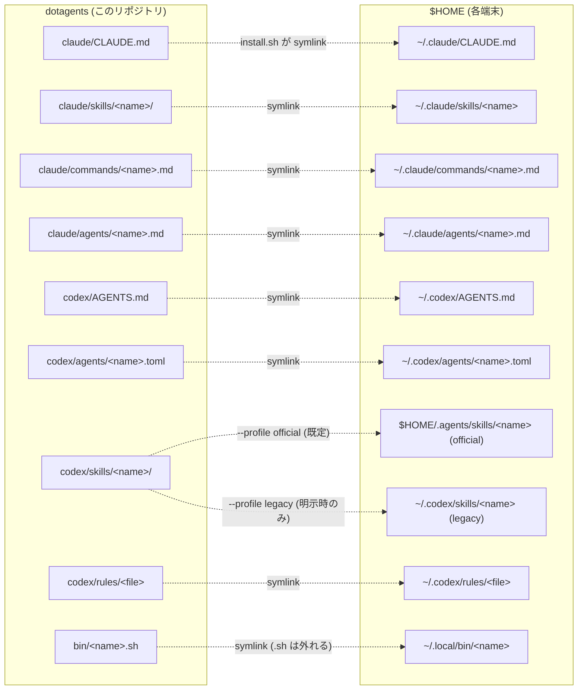

# dotagents

Claude Code / Codex の環境そのもの（skill・command・agents・rule・グローバル CLAUDE.md・罠DB・調査資産・環境整備の聖典）を**複数端末で同期する個人 dotfiles**。GitHub が真実の源。

- **趣旨・原則・残件**: [PLAN.md](PLAN.md)（憲章＝聖典 v4。プランは docs/ で TODO を兼ねる）
- **AI 向けの掟（全エージェント共通）**: [AGENTS.md](AGENTS.md)（Claude は [CLAUDE.md](CLAUDE.md) が `@AGENTS.md` で取り込む）。**URL を渡された AI のオンボーディング入口も AGENTS.md**（「AI オンボーディング」節）

## 構成

```
dotagents/
├── PLAN.md              … 開発工場の憲章（趣旨・原則・定常運用・残件）
├── AGENTS.md            … 全 AI 共通のプロジェクト正典＋AI オンボーディング入口
├── CLAUDE.md            … Claude 用の薄いラッパ（@AGENTS.md ＋ ベル固有）
├── install.sh           … symlink 配置（冪等・実ファイルは SKIP・失敗は停止）
├── docs/                … 00_overview.md（地図）・02_models.md（役割→モデル対応表）・01_project-layout.md・進行中プラン／archive/（役目を終えた文書）
├── rag/                 … 調査・研究の再利用棚（INDEX.md＋topic/raw/ 一次ソース）
├── claude/
│   ├── CLAUDE.md        … グローバル鉄則の正本（→ ~/.claude/CLAUDE.md）
│   ├── skills/          … → ~/.claude/skills/<name>
│   ├── commands/        … → ~/.claude/commands/<name>.md
│   └── agents/          … → ~/.claude/agents/<name>.md
├── codex/
│   ├── AGENTS.md        … Codex グローバル規範の正本（→ ~/.codex/AGENTS.md）
│   ├── agents/          … → ~/.codex/agents/<name>.toml
│   ├── skills/          … → $HOME/.agents/skills/<name>（既定。legacy は明示指定）
│   └── rules/           … → ~/.codex/rules/<file>
└── bin/                 … → ~/.local/bin/<name>（.sh は外れる。実行言語は shebang）
```



Codex skill は同一端末・同一入口で **official / legacy の一方だけ**に置く。既定は公式 user skill 面
`$HOME/.agents/skills`。古い入口の互換検証だけ `./install.sh --profile legacy` を明示し、
`verify-install --profile legacy` を通す。installer は反対面を勝手に削除しない。

## 同梱資産

| 種類 | 名前 | 用途 |
|---|---|---|
| Claude skill | `orchestrate` | 多エージェント/多モデル統括の標準型（憲法8カ条・委譲契約・Workflow 雛形） |
| Codex skill | `orchestrate` | 製品中立の共通契約を読み、Codex native subagent で統括する製品固有入口 |
| Claude skill | `audit-gauntlet` | 文書を ultracode 型監査（並列多視点→敵対的反証→Critic）で磨き込む |
| Claude skill | `auto-deploy-on-push` | push 契機の SSH + docker compose 自動デプロイ構築 |
| Codex skill | `audit-gauntlet` | native finder→existence/value独立反証→Critic→親裁定で文書を監査 |
| Codex skill | `auto-deploy-on-push` | read-only調査とH承認を先行するpush起点デプロイ構築 |
| Claude agent | `implementer` | 委譲契約焼き込み済みの実装者（安価枠。対応表は docs/02_models.md） |
| Claude agent | `refuter` | 敵対的検証者（読み取り専用） |
| Claude command | `audit-gauntlet` / `auto-deploy-on-push` / `polish-github` | 各スキルの入口（audit-gauntlet は skill への相対 symlink） |
| Codex skill | `polish-github` | GitHub presentation 整備（正本は Claude 版・Codex 版は薄いポインタ＝一本化済み） |
| Codex rule | `default.rules` | Codex 常時適用ルール |
| Codex グローバル規範 | `codex/AGENTS.md` | ベルの共通憲法＋Codex 固有のモデル配置・ネイティブ委譲・shell 入口（2026-07 リポ正本化。対応表は docs/02_models.md） |
| Codex サブエージェント | `codex/agents/{implementer,refuter,sorter}.toml` | ネイティブ委譲定義（terra×medium / sol×high×read-only / luna×low） |
| bin | `agents-update.sh` | curated CLI / SDK 群を `@latest` に一括更新（週1 cron 推奨） |
| bin | `verify-codex-agent-routing.sh` | spawn 後、role/model/effort/developer instructions を検証し、sandbox実効値を別表示 |
| bin | `apply-codex-config.sh` | routing 2キーと dotagents hook 4イベントだけを dry-run / backup / 冪等適用する（`--apply` は端末承認後） |
| データ | `~/.caveat/own`（dotagents 外） | 外部仕様の罠DB（caveat MCP が参照）。**v0.15+ で Caveat 自身が管理**——`~/.caveat/own` は独立 git repo で remote は private の `Caveat-Private`（全端末同期）。public 部分集合は `caveat publish` で `Caveat-Public` にミラー。dotagents は所有しない |
| 知識 | `rag/` | 調査の一次ソース＋結論（第二の脳。人間用の窓は Obsidian） |
| 設定 | `.codex-sidecar.yml` | codex-sidecar 委譲のプロジェクト既定（model/effort・readonly。正典 docs/05_codex-fragments.md） |

Claude command の Codex 正規入口は slash command の模造ではなく、対応 skill の明示 invocation とする。

| Claude command | Codex 入口 |
|---|---|
| `/audit-gauntlet` | `$audit-gauntlet` |
| `/auto-deploy-on-push` | `$auto-deploy-on-push` |
| `/polish-github` | `$polish-github` |

### Codex 9面の対応状況

「全対応」はファイル数の左右対称ではなく能力対称で判定する。詳細な合格条件と進捗は
[Codex 全対応計画](docs/plan_codex-full-support.md) が正本。

| 面 | dotagents の正規入口 | 状態 |
|---|---|---|
| AGENTS_MD | `codex/AGENTS.md`＋リポごとの `AGENTS.md` | 対応済み |
| CONFIG | `docs/05_codex-fragments.md`＋`apply-codex-config`＋`verify-install` | 必須断片を限定適用・検証 |
| SKILLS | `codex/skills/` → user skill 面 | 移行中（公式面を既定化） |
| PLUGINS | — | 非採用（個人git＋symlink配布と二重化するため） |
| MCP_SERVER_CONFIG | `docs/05_codex-fragments.md` | 親別 matrix・登録/list/疎通手順を正本化 |
| SUBAGENTS | `codex/agents/*.toml`＋`verify-codex-agent-routing` | 対応済み |
| HOOKS | `bin/codex-callout-hook.sh`＋`docs/05_codex-fragments.md` | INFO 契約で対応済み |
| COMMANDS | Claude command に対応する Codex skill | 対応表を上記へ固定 |
| SESSIONS | Throughline＋Codex handoff smoke | 外部正本を Wave 2-3 で受入検証予定 |

## 他端末セットアップ・ランブック

### 0. 前提（未充足ならここで導入。所要時間は状態次第）

- **git**: 鍵設定済み・`gh auth status` OK・**identity 設定**（未設定だと hostname 由来の偽メールで履歴が汚れる）:
  ```bash
  git config --global user.name "kitepon-rgb"
  git config --global user.email "kitepon-rgb@users.noreply.github.com"
  git config --global init.defaultBranch main   # 新規リポが master で生まれるのを防ぐ（2026-07-04 実被弾）
  printf '.DS_Store\n' > ~/.gitignore_global && git config --global core.excludesfile ~/.gitignore_global  # macOS ノイズを全リポで抑止
  ```
- **WSL2 の場合**: WSL2 内の Claude/Codex を対象とする（Windows 側とは別環境。install.sh は実行した環境の `$HOME` に symlink を張る）。cron の起動は下の「自動アップデート」節参照
- **ランタイム**: node>=22＋corepack・docker・python3（`command -v node docker` で存在確認、`node --version` が v22+、`docker info` が通ること。**python3 だけは実行判定 `python3 -c "print(1)"` で確認**——Windows のストア偽エイリアスは存在チェックを通り、黙って exit 0 を返す〔罠DB `windows-python3-store-exit-0`〕）
- **CLI（必須）**: Claude Code・Codex CLI・markitdown（JS ページは空を吐く罠あり→caveat 参照）。`command -v claude codex markitdown` で確認
- **CLI（任意）**: Grok Build＝**要 `grok login`（H）**。未認証だと `grok agent` が使えず、`delegate grok` は明示エラーで停止する（委譲は当面 Codex 主で回る＝必須ではない）
- **MCP 用 CLI を先に入れる**（下の登録が参照する。`agents-update` が入れる `caveat-cli`・codegraph も同源）: `aiterm-mcp`・`caveat`・`codegraph` が PATH にあること（`command -v aiterm-mcp caveat codegraph`）
- **MCP（ユーザースコープ登録。上の CLI 導入後）**:
  ```bash
  claude mcp add --scope user aiterm -- aiterm-mcp
  claude mcp add --scope user caveat -- caveat mcp-server
  claude mcp add --scope user codegraph -- codegraph serve --mcp
  ```
- **人間用の窓（任意だが標準）**: Obsidian（`brew install --cask obsidian`。無料・md 直読み。vault 設定 `.obsidian/` は端末ローカル＝gitignore 済み）
- **home-server ssh**: `kite@192.168.1.2` 直IP（固定IP・エイリアスは作らない）

### 1. clone（パスは全端末で `~/Developer/dotagents` に統一。旧 `~/projects` は廃止）

```bash
gh repo clone kitepon-rgb/dotagents ~/Developer/dotagents   # gh 認証を使う（SSH 鍵の有無に依存しない）
cd ~/Developer/dotagents
```

### 2. 既存実ファイルの退避（重要——install.sh は実ファイルを SKIP する）

`mkdir -p ~/Archives` してから:

```bash
tar czf ~/Archives/claude-pre-dotagents-$(date +%Y%m%d).tar.gz -C "$HOME" .claude/CLAUDE.md .claude/skills .claude/agents .claude/commands .codex/AGENTS.md 2>/dev/null || true
# グローバル CLAUDE.md / Codex AGENTS.md の実ファイルが残っていると正本化が静かに不成立になる
[ -f ~/.claude/CLAUDE.md ] && [ ! -L ~/.claude/CLAUDE.md ] && rm ~/.claude/CLAUDE.md
# ~/.codex/AGENTS.md が実ファイルなら先に中身を確認——価値ある行は codex/AGENTS.md へ PR してから退避・削除する
[ -f ~/.codex/AGENTS.md ] && [ ! -L ~/.codex/AGENTS.md ] && rm ~/.codex/AGENTS.md
```

**caveat の own は Caveat 自身が同期する**（v0.15+。dotagents は所有しない）: 新端末では `caveat sync --init --repo https://github.com/kitepon-rgb/Caveat-Private.git` で `~/.caveat/own` に Caveat-Private を clone → 以降 `caveat sync` で往復。既存端末に端末ローカルの罠が残っていたら、`caveat sync` の前に中身を `~/.caveat/own/entries/<category>/` へマージしてから同期する（同名衝突は中身を見て統合）。`verify-install` は own が Caveat-Private を remote に持つか確認する。

### 3. install → 検証バッテリー

```bash
./install.sh --profile official
./bin/apply-codex-config --dry-run
```

既定は公式 user skill 面 `$HOME/.agents/skills`。`--dry-run` は一切書き込まず、routing の必須2キーと
dotagents 固有 hook 4イベントだけの差分を出す。対象端末への適用を承認した後だけ、次を実行する。

```bash
./bin/apply-codex-config --apply
./bin/verify-install.sh --profile official
```

`--apply` は `~/Archives/` に backup を作り、model / effort / permissions / OAuth / trust / 他ツールの
hook は変更しない。legacy を選ぶのは旧入口の検証時だけで、`--profile legacy` を install / verify の両方へ付ける。

- **`./bin/verify-install.sh --profile official` が OK を返すこと（省略不可）**——stale 実ファイル・反対 skill 面の同名重複・routing / hook 契約不足を FAIL 行で名指しする。`~/.local/bin` を PATH に通していれば以後は `verify-install --profile official` でも可
- **呼びかけ hook の配線**（AGENTS.md 手順5/6）: Claude 側 `settings.json`（C1-C4）は docs/03 の手順で配線する。Codex 側 X1-X5 は `apply-codex-config` が4イベントを限定して冪等正規化する。両方とも trust 承認は別途必要。断片・復旧手順は docs/03・docs/05 が正本
- 新しい Claude Code セッションで（対話確認）: グローバル CLAUDE.md がロードされる／`orchestrate`・`audit-gauntlet` が skill 一覧に出る／`implementer`・`refuter` が agent 一覧に出る／pty（aiterm）と caveat が `/mcp` で connected／極小タスクを implementer に委譲して契約どおりの報告が返る
- 新しい Codex セッションで（対話確認）: skill 一覧に `orchestrate` が出る／`spawn_agent` schema に `agent_type` がある／`agent_type=<role>` と `fork_turns="none"` で routing smoke だけを起動／`verify-codex-agent-routing <role> <agent-path>` が green の時だけ follow-up task を渡す

### 4. その端末のメモリ整理

`orchestrate` references の bulk-curation 手順で（各端末のメモリはその端末でしか整理できない。リポ操作でないため P2 掃引より先で OK）。

## 自動アップデート（常設・全端末必須）

`~/.local/bin/agents-update` が curated CLI / SDK / MCP 群 (Claude Code / Codex CLI / aiterm-mcp / Codex Sidecar / Throughline / Caveat / Codegraph / claude-spotter / Anthropic SDK / pnpm) を `@latest` に揃える。**「推奨」ではなく常設が必須**（2026-07-04 実測: この一手を省いた端末では旧世代の自動更新が別リストで回り続け、真実が二重化していた）。

**Step 0 — 旧自動更新の撲滅（一つの真実）**: 先に古い npm 自動更新が居ないか掃引し、居たら停止・撤去する。

```bash
crontab -l 2>/dev/null | grep -i npm                    # 旧 cron 行
ls ~/Library/LaunchAgents/ 2>/dev/null | grep -i -E "npm|update"  # 旧 LaunchAgent（例: com.kite.update-npm-globals = tools-manager 製）
# 居たら: plist を tar でバックアップ → launchctl bootout gui/$UID/<label> → plist 削除／crontab 行削除
```

**Step 1 — 常設**:

- **macOS（launchd）**:

```bash
cat > ~/Library/LaunchAgents/com.kite.agents-update.plist <<'EOF'
<?xml version="1.0" encoding="UTF-8"?>
<!DOCTYPE plist PUBLIC "-//Apple//DTD PLIST 1.0//EN" "http://www.apple.com/DTDs/PropertyList-1.0.dtd">
<plist version="1.0"><dict>
  <key>Label</key><string>com.kite.agents-update</string>
  <key>ProgramArguments</key><array>
    <string>/bin/sh</string><string>-c</string><string>"$HOME"/.local/bin/agents-update</string>
  </array>
  <key>StartCalendarInterval</key><dict>
    <key>Weekday</key><integer>1</integer><key>Hour</key><integer>4</integer><key>Minute</key><integer>0</integer>
  </dict>
  <key>RunAtLoad</key><false/>
</dict></plist>
EOF
launchctl bootstrap gui/$UID ~/Library/LaunchAgents/com.kite.agents-update.plist
```

- **Linux / WSL2（cron）**: cron 稼働確認（WSL2: `sudo service cron start`＋`/etc/wsl.conf` の `[boot]` に `command = "service cron start"`）→ `crontab -e` に `0 4 * * 1 $HOME/.local/bin/agents-update`（端末が起動している時間帯に合わせる）

**Step 2 — 実走行で検証**（配線したつもりで一度も走らない、を防ぐ）:

```bash
launchctl kickstart gui/$UID/com.kite.agents-update   # macOS。Linux は $HOME/.local/bin/agents-update を直接一回
tail -5 ~/.local/state/agents-update/agents-update.log # "agents-update end" 行が出ること（実ログの完了行。旧記載 "Finished" は実装と不一致だった）
```

対象 package は `bin/agents-update.sh` 先頭の `PACKAGES=( ... )` を直接編集（**`npm link` / `npm install -g .` 中の package は先に外す**——registry 版で上書きされる）。

## 編集ワークフロー

**作業前に必ず `git fetch` → origin/main と照合**（複数端末リポの掟。詳細は [CLAUDE.md](CLAUDE.md)）。スキル / コマンドは `~/.claude/...` 経由でもリポ実体の直接編集でも同じファイル（symlink）。編集後は `git add -p && git commit && git push` で真実を返す。他端末は `git pull` のみで反映（新規エントリ追加時のみ `./install.sh` 再実行）。

## 含めないもの

- `~/.claude/skills/learned/` — 自動学習で増減するため端末ローカル
- `~/.claude/{settings.json,plugins,projects,sessions}` — 端末固有 / 認証情報（端末メモリ含む。設定の推奨断片は docs/03_settings-fragments.md）
- `~/.codex/{config.toml,auth.json,sessions,*.sqlite}` — 同上
- `~/.codex/skills/.system/` — Codex CLI バンドルのシステム skill
- ~~`~/.codex/AGENTS.md`~~ — 2026-07 にリポ正本化（`codex/AGENTS.md` → symlink 配布）。端末ローカルの緊急上書きは `~/.codex/AGENTS.override.md`（非コミット・`bin/verify-install.sh` が非空を FAIL 名指し）
- 罠DB（旧 `caveat/`）は **v0.15+ で dotagents の外**へ移管済み。`~/.caveat/own` を Caveat 自身が private の Caveat-Private へ同期する（public/private とも）。第三者共有は `caveat publish` が public のみ Caveat-Public へ抽出。旧 `*.private.md` gitignore ガードは死に文だったため撤廃
- リポ直下の `.claude/` `.vscode/` `.obsidian/` — 端末固有状態（gitignore 済み）
