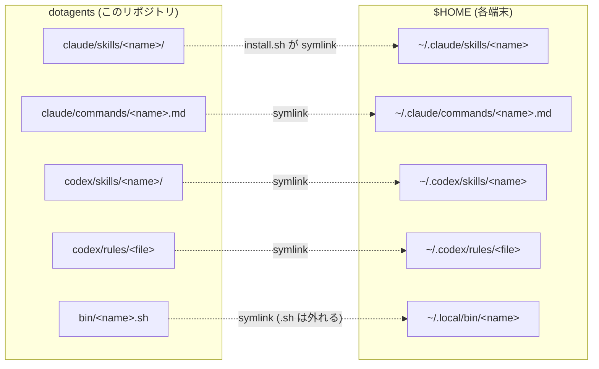

# dotagents

Claude Code と Codex の自作スキル・スラッシュコマンドを端末間で同期するための個人 dotfiles リポジトリ。

## 構成

```
dotagents/
├── claude/
│   ├── skills/         → ~/.claude/skills/<name>/SKILL.md
│   └── commands/       → ~/.claude/commands/<name>.md
└── codex/
    ├── skills/         → ~/.codex/skills/<name>/
    └── rules/          → ~/.codex/rules/
```

スキルは `SKILL.md` を含むディレクトリ、コマンドは単一 `.md` ファイル。

`install.sh` がリポジトリ内の各エントリを home 配下へ symlink するため、リポジトリ側を編集すれば即座に `~/.claude/...` / `~/.codex/...` に反映される (逆も同じ)。



## 同梱しているスキル・コマンド

| 種類 | 名前 | 用途 |
|---|---|---|
| Claude skill | `audit-gauntlet` | 計画書・仕様書・設計書を 3 段関門 (多角監査 → 矛盾収束 → 実現性収束) で磨き込む |
| Claude skill | `auto-deploy-on-push` | GitHub への push を契機に SSH 到達可能なホストへ自動 docker compose デプロイするワークフローを構築 |
| Claude command | `auto-deploy-on-push` | 上記スキルを呼ぶスラッシュコマンド |
| Claude command | `polish-github` | GitHub の見栄え (メタデータ / README / Release / 図 / CI バッジ) を整える。まず監査し GO 後に着手 |
| Claude command | `audit-gauntlet` | 同名スキルへの相対 symlink (本文を二重管理しない) |
| Codex skill | `polish-github` | Claude 版と同等の GitHub presentation 整備を Codex で実行 |
| Codex skill | `throughline` | Codex セッションの記憶 (Throughline) の復元・継続・trim/rewind を扱う |
| Codex rule | `default.rules` | Codex の常時適用ルール (グローバル AGENTS.md 配置など) |
| bin スクリプト | `agents-update.sh` | curated な CLI / SDK 群を `@latest` に一括更新 (`~/.local/bin/agents-update`) |

## 新しい端末でのセットアップ

```bash
git clone git@github.com:kitepon-rgb/dotagents.git ~/projects/dotagents
cd ~/projects/dotagents
./install.sh
```

`install.sh` は `~/.claude/{skills,commands}`、`~/.codex/{skills,rules}`、
そして `~/.local/bin/` (bin/ 配下の実行スクリプト) に本リポジトリの各エントリを
**symlink** で配置する。ファイル単位の symlink なので、端末ローカルにしか無い
スキル (例: `~/.claude/skills/learned/`) は触らない。

## 自動アップデート (任意)

`install.sh` 後、`~/.local/bin/agents-update` で curated CLI / SDK 群
(Claude Code / Codex CLI / Throughline / Caveat / Codegraph / Codex Sidecar MCP /
claude-spotter / Anthropic SDK) を `@latest` に揃えられる。週 1 cron で自動化推奨。

### 1. cron を起動

- Linux 一般: 既に動いている (`service cron status`)
- WSL2: default 停止。`sudo service cron start` で起動。再起動時にも立ち上げるには `/etc/wsl.conf` の `[boot]` セクションに `command = "service cron start"` を追加

### 2. crontab に 1 行追加

```bash
crontab -e
```

例 (毎週月曜 12:00):

```cron
0 12 * * 1 $HOME/.local/bin/agents-update
```

時刻は **その端末が起動している時間帯** に合わせる (cron は停止時間を catch up しない)。

### 3. ログ

```bash
tail -f ~/.local/state/agents-update/agents-update.log
```

### 4. 対象 package の編集

`bin/agents-update.sh` 先頭の `PACKAGES=( ... )` を直接編集。`npm link` で開発中の package はリストから外す (registry 版で上書きされるため)。

## 編集ワークフロー

スキル / コマンドは `~/.claude/...` または `~/.codex/...` 経由でも、リポジトリ内
の実体を直接編集してもよい (symlink なので同じファイル)。編集後はそのまま
`git add -p && git commit && git push` で他端末へ共有。

## 含めないもの

- `~/.claude/skills/learned/` — 自動学習で増減するため端末ローカル
- `~/.claude/{settings.json,plugins,projects,sessions}` — 端末固有の状態 / 認証情報
- `~/.codex/{config.toml,auth.json,sessions,*.sqlite}` — 同上
- `~/.codex/skills/.system/` — Codex CLI バンドルのシステムスキル
- `~/.codex/AGENTS.md` — グローバル指示。意図的に各端末で別管理する場合に追加検討
