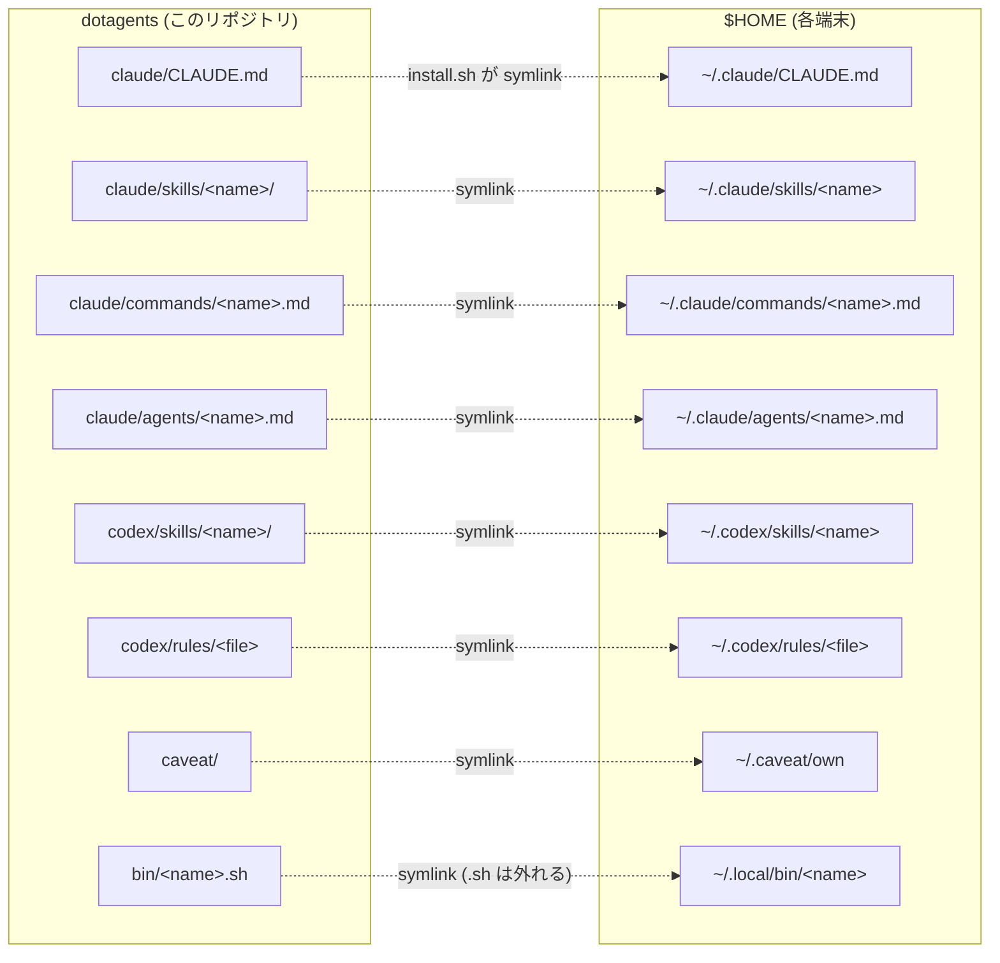

# dotagents

Claude Code / Codex の環境そのもの（skill・command・agents・rule・グローバル CLAUDE.md・罠DB・調査資産・環境整備の聖典）を**複数端末で同期する個人 dotfiles**。GitHub が真実の源。

- **方針と理由**: [PLAN.md](PLAN.md)（聖典）／ **消化状況**: [docs/TODO.md](docs/TODO.md)
- **AI 向けの掟**: [CLAUDE.md](CLAUDE.md)

## 構成

```
dotagents/
├── PLAN.md              … 環境整備の聖典（方針・原則・理由）
├── CLAUDE.md            … このリポで働く AI への指示
├── install.sh           … symlink 配置（冪等・実ファイルは SKIP・失敗は停止）
├── docs/                … TODO.md（消化管理）・MODELS.md（役割→モデル対応表）・settings.fragments.md
├── rag/                 … 調査・研究の再利用棚（INDEX.md＋topic/raw/ 一次ソース）
├── caveat/              … 罠DB（→ ~/.caveat/own。*.private.md は端末ローカル維持）
├── claude/
│   ├── CLAUDE.md        … グローバル鉄則の正本（→ ~/.claude/CLAUDE.md）
│   ├── skills/          … → ~/.claude/skills/<name>
│   ├── commands/        … → ~/.claude/commands/<name>.md
│   └── agents/          … → ~/.claude/agents/<name>.md
├── codex/
│   ├── skills/          … → ~/.codex/skills/<name>
│   └── rules/           … → ~/.codex/rules/<file>
└── bin/                 … → ~/.local/bin/<name>（.sh は外れる）
```



## 同梱資産

| 種類 | 名前 | 用途 |
|---|---|---|
| Claude skill | `orchestrate` | 多エージェント/多モデル統括の標準型（憲法7カ条・委譲契約・Workflow 雛形） |
| Claude skill | `audit-gauntlet` | 文書を ultracode 型監査（並列多視点→敵対的反証→Critic）で磨き込む |
| Claude skill | `auto-deploy-on-push` | push 契機の SSH + docker compose 自動デプロイ構築 |
| Claude agent | `implementer` | 委譲契約焼き込み済みの実装者（安価枠。対応表は docs/MODELS.md） |
| Claude agent | `refuter` | 敵対的検証者（読み取り専用） |
| Claude command | `audit-gauntlet` / `auto-deploy-on-push` / `polish-github` | 各スキルの入口（audit-gauntlet は skill への相対 symlink） |
| Codex skill | `polish-github` | GitHub presentation 整備（Claude 版と一本化予定＝TODO P0-12） |
| Codex rule | `default.rules` | Codex 常時適用ルール |
| bin | `agents-update.sh` | curated CLI / SDK 群を `@latest` に一括更新（週1 cron 推奨） |
| データ | `caveat/` | 外部仕様の罠DB（caveat MCP が参照。public 級のみ同期） |
| 知識 | `rag/` | 調査の一次ソース＋結論（第二の脳。人間用の窓は Obsidian） |

## 他端末セットアップ・ランブック

### 0. 前提（未充足ならここで導入。所要時間は状態次第）

- **git**: 鍵設定済み・`gh auth status` OK・**identity 設定**（未設定だと hostname 由来の偽メールで履歴が汚れる）:
  ```bash
  git config --global user.name "kitepon-rgb"
  git config --global user.email "kitepon-rgb@users.noreply.github.com"
  git config --global init.defaultBranch main   # 新規リポが master で生まれるのを防ぐ（2026-07-04 実被弾）
  ```
- **ランタイム**: node>=22＋corepack・docker・python3
- **CLI**: Claude Code・Codex CLI・Grok Build・markitdown（JS ページは空を吐く罠あり→caveat 参照）
- **MCP（ユーザースコープ登録。コマンドは実測値）**:
  ```bash
  claude mcp add --scope user aiterm -- aiterm-mcp
  claude mcp add --scope user caveat -- caveat mcp-server
  claude mcp add --scope user codegraph -- codegraph serve --mcp
  ```
- **人間用の窓（任意だが標準）**: Obsidian（`brew install --cask obsidian`。無料・md 直読み。vault 設定 `.obsidian/` は端末ローカル＝gitignore 済み）
- **home-server ssh**: `kite@192.168.1.2` 直IP（固定IP・エイリアスは作らない）

### 1. clone（パスは全端末で `~/Developer/dotagents` に統一。旧 `~/projects` は廃止）

```bash
git clone git@github.com:kitepon-rgb/dotagents.git ~/Developer/dotagents
cd ~/Developer/dotagents
```

### 2. 既存実ファイルの退避（重要——install.sh は実ファイルを SKIP する）

```bash
tar czf ~/Archives/claude-pre-dotagents-$(date +%Y%m%d).tar.gz -C "$HOME" .claude/CLAUDE.md .claude/skills .claude/agents .claude/commands 2>/dev/null || true
# グローバル CLAUDE.md の実ファイルが残っていると正本化が静かに不成立になる
[ -f ~/.claude/CLAUDE.md ] && [ ! -L ~/.claude/CLAUDE.md ] && rm ~/.claude/CLAUDE.md
# caveat: 端末ローカルの own エントリは、リポの caveat/entries へ手動マージしてから
[ -d ~/.caveat/own ] && [ ! -L ~/.caveat/own ] && echo "要マージ: ~/.caveat/own の中身を caveat/entries へ移してから ~/.caveat/own を退避・削除"
```

### 3. install → 検証バッテリー

```bash
./install.sh
ls -la ~/.claude/skills ~/.claude/commands ~/.claude/agents ~/.claude/CLAUDE.md ~/.codex/skills ~/.codex/rules ~/.caveat/own
```

- **`ls -la` の link 先が全て本リポを向いていること（省略不可**——stale 実ファイルが残っていても他の検証は合格してしまう）
- 新しい Claude Code セッションで: グローバル CLAUDE.md がロードされる／`orchestrate`・`audit-gauntlet` が skill 一覧に出る／`implementer`・`refuter` が agent 一覧に出る
- pty（aiterm）と caveat の疎通確認
- 極小タスクを implementer に委譲して、委譲契約どおりの報告が返ること

### 4. その端末のメモリ整理

`orchestrate` references の bulk-curation 手順で（各端末のメモリはその端末でしか整理できない。リポ操作でないため P2 掃引より先で OK）。

## 自動アップデート (任意)

`install.sh` 後、`~/.local/bin/agents-update` で curated CLI / SDK 群 (Claude Code / Codex CLI / Throughline / Caveat / Codegraph / Codex Sidecar MCP / claude-spotter / Anthropic SDK) を `@latest` に揃えられる。週 1 cron 推奨。

1. cron 起動（Linux: 稼働確認 `service cron status`／WSL2: `sudo service cron start`＋`/etc/wsl.conf` の `[boot]` に `command = "service cron start"`）
2. `crontab -e` に例: `0 12 * * 1 $HOME/.local/bin/agents-update`（端末が起動している時間帯に合わせる）
3. ログ: `tail -f ~/.local/state/agents-update/agents-update.log`
4. 対象 package は `bin/agents-update.sh` 先頭の `PACKAGES=( ... )` を直接編集（`npm link` 中の package は外す）

## 編集ワークフロー

**作業前に必ず `git fetch` → origin/main と照合**（複数端末リポの掟。詳細は [CLAUDE.md](CLAUDE.md)）。スキル / コマンドは `~/.claude/...` 経由でもリポ実体の直接編集でも同じファイル（symlink）。編集後は `git add -p && git commit && git push` で真実を返す。他端末は `git pull` のみで反映（新規エントリ追加時のみ `./install.sh` 再実行）。

## 含めないもの

- `~/.claude/skills/learned/` — 自動学習で増減するため端末ローカル
- `~/.claude/{settings.json,plugins,projects,sessions}` — 端末固有 / 認証情報（端末メモリ含む。設定の推奨断片は docs/settings.fragments.md）
- `~/.codex/{config.toml,auth.json,sessions,*.sqlite}` — 同上
- `~/.codex/skills/.system/` — Codex CLI バンドルのシステム skill
- `~/.codex/AGENTS.md` — グローバル指示（端末別管理の選択肢を残す）
- `caveat/**/*.private.md` — private 級の罠は端末ローカル（caveat 自前の gitignore で強制）
- リポ直下の `.claude/` `.vscode/` `.obsidian/` — 端末固有状態（gitignore 済み）
