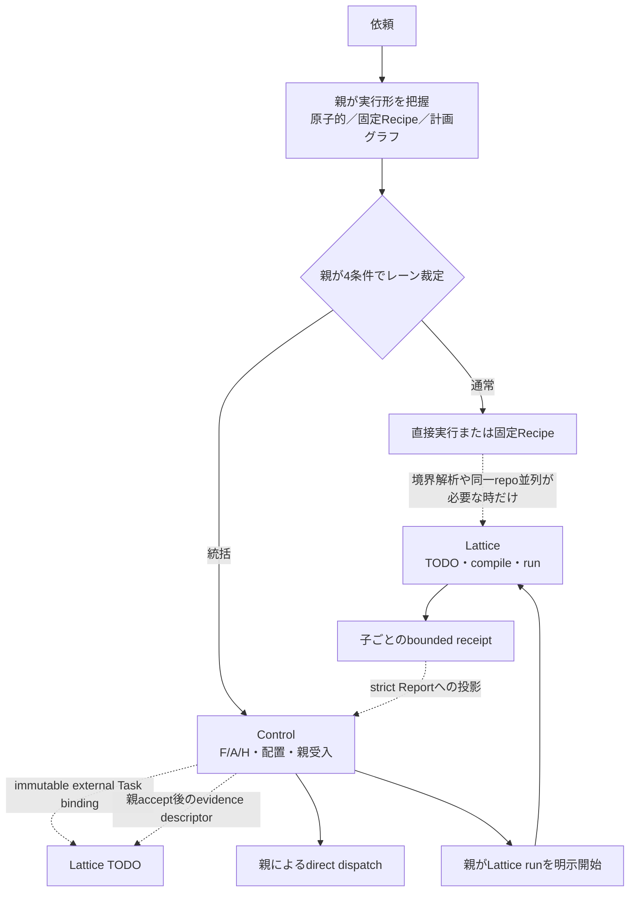

# Composable Orchestration 完成計画

Status: implementation not started

## 工程正本

この文書は目的、設計思想、裁定理由、非目標、受入条件だけを所有する。実装Task、依存、状態、
完了証拠の正本はLatticeの`factory-master`後継revisionであり、本書へcheckboxや進捗表を複製しない。

- Lattice project: `dotagents`
- Lattice plan: `factory-master`
- Active successor: `rev-5878b6b9d54eabb5f3309427`
- Plan digest: `57066883e2d27099fe2433fa48fb1f35c84a4239ac2f4a9de377aa3eada733af`
- Topology digest: `340b9f21c76fcbaf633fedfe96730115716f08ac81681fe6d91bd1cc5aa239ce`
- Plan artifact: `.lattice/todo/plans/factory-master/rev-5878b6b9d54eabb5f3309427/plan.json`
- Authoring transaction:
  `docs/migration/revisions/factory-master-composable-orchestration-20260723.json`
- 発見入口: `lattice status --json`
- 工程入口: `lattice todo status --json`

初期化済みstoreへ新しいplan membershipを追加する公開入口はLattice 0.12.7にないため、本戦役は
既存`factory-master`のfull desired-state successorとして正本化する。`todo migrate`を新規authoringへ
流用しない。新plan追加機能そのものは本戦役の目的ではない。

## 目的

dotagentsのオーケストレーションを、強い部品が並んでいる状態から、次の一続きの運用契約へ完成させる。

1. 親が作業構造から通常／統括レーンを裁定する。
2. 固定Recipe、Control、Latticeを必要な時だけ組み合わせる。
3. 各コア製品は、他製品が未導入・停止・非互換でも単独製品として機能する。
4. 連携時だけ、公開schemaとimmutable digestで能力を増幅する。
5. Task、実行、受入、証拠の所有者を一意に保ち、二重正本を作らない。

目標は巨大な統合オーケストレータではない。単独で強い製品を、薄い型付き境界で安全に合成できる
開発工場である。

## 着手裁定

本戦役の実装は、受入が複数段に連鎖し、dotagentsとLatticeの複数repo書込みを調整し、
公開契約の裁定証拠を要するため統括レーンとする。実装着手時にControlを作成し、
契約クリティカルな設計、schema、依存方向、受入裁定をFとして親が所有する。

計画作成時のread-only調査と独立反証には、比例原則によりControl Packetを課さない。

## 現在地

2026-07-23時点で、個々の面は強いが連続した実行経路になっていない。

| 面 | 現在の実体 | 切れ目 |
|---|---|---|
| 固定Workflow | Claude向けの`adversarial-audit`と`bulk-curation`のJS雛形 | host共通の静的Recipe契約がなく、CodexではClaude固有入口を使えない |
| レーン裁定 | 親がADR 0061の4条件ORを着手時に意味判断する | 裁定結果を後続境界へ渡すclosedな型がない |
| Control | Task、placement、reservation、Run、Report、親accept/reject、finalizationを所有 | Lattice task/runとのdigest-bound相関がない |
| Lattice TODO | Task DAG、Phase、evidence、ready frontierを所有 | ControlがfrontierとTask identityを消費していない |
| Lattice run | boundary compile、worktree、子dispatch、receipt、resume/closeを所有 | 子ごとの結果をControlのstrict acceptanceへ投影していない |
| 親dispatch | 親がExecutor固有入口を明示実行する | これは維持すべき境界であり、自動dispatchへ移さない |

既知の前提不整合も、連携実装より先に閉じる。

- 現行Lattice CLIは0.12.7で`lattice.todo_status_result.v4`を返すが、dotagents工程hookはv1〜v3だけを受理する。
- `lattice status --json`が正規discovery入口だが、現hookには`.lattice/todo`の存在で早期判定する箇所がある。
- `lattice run list --json`は現repoで`INVALID_RUN_STORE`を返すが、現advisoryは失敗を空集合へ丸める。
- 委譲契約にはLatticeの`resume`／`close`が未実装という古い記述が残る。
- Controlのphase gate強制はCLIと直接library APIで一致していない。
- Lattice Taskの`compile_binding`はschema上存在するが、現行`todo start`のreadiness gateとは接続していない。
- `dispatch_frontier`のdigestは候補集合のidentityであり、予約やCASではない。
- `lattice.executor_receipt.v1`は子のpacket、worktree、epoch、observed diffを証明するが、
  TODOのproject／plan identityとControl相関を単独では持たない。

## 設計原則

### 1. 単体成立を最上位制約にする

- Latticeはdotagents／Controlなしで、plan、compile、run、observe、resume、close、abandonを完結する。
- ControlはLatticeなしで、manual Task、placement、direct dispatch相関、accept/reject、archiveを完結する。
- 固定RecipeはLattice／Controlなしでhostの正規入口から実行できる。
- 連携障害は連携による増幅能力だけを止め、無関係な単独機能を止めない。
- 相手製品のDB、管理directory、内部moduleを直接読み書きしない。公開CLIとversioned schemaだけを使う。

### 2. レーンと実行形を直交させる

レーンは`normal | orchestrated`の二つだけとし、ADR 0061の裁定を変えない。

実行形は、作業の表現を説明する補助軸であり、第三レーンや新しい永続stateではない。

- 原子的作業: 親が直接閉じる。
- 固定Recipe: 既知の手順とfan-outをhost固有入口で実行する。
- 計画グラフ: LatticeがTask DAG、Phase、ready frontierを所有する。

固定Recipeに複数agentが含まれること、Task数やrepo数が多いこと、長くなりそうなことだけでは
統括レーンへ上げない。統括レーンへ入るのは、着手時点で4条件のどれかが事実として確定した時だけである。

### 3. 一つの意味に一つの正本を置く

| 意味 | 正本 |
|---|---|
| 目的、判断理由、非目標、受入条件、不変Decision | docs／git |
| Task、依存、Phase、ready、工程状態、完了証拠 | Lattice TODO store |
| boundary、compiled plan、worktree、Lattice子dispatch、run lifecycle | Lattice run store |
| F/A/H、placement、reservation、Worker相関、親accept/reject、Control finalization | Control |
| session/job、credential、provider retry/cancel、製品固有handle | 各Executor製品 |
| H承認の真正性 | オーナーとの会話 |

ControlはLatticeのDAG、Phase、ready、run stateを複製しない。LatticeはControlのplacement、
Executor state、親accept/reject、H承認を複製しない。

### 4. 親だけが意味裁定とdispatchを行う

レーン裁定、ready集合からの選択、意図的直列化、Executor選択、dispatch、accept/rejectは親が行う。
hook、adapter、catalog、Lattice frontierは候補、観測、検証材料を返すだけで、自動起動しない。

### 5. 連携はclosed projectionに限定する

Control Taskへ持たせる外部Task相関は、少なくとも
`namespace / contract_version / external_id / immutable_digest`からなるclosed tupleとする。
自由形式metadata、外部label、外部state、外部依存のcopyは許さない。

子実行の連携も、Lattice公開receiptからTask別scope、結果digest、terminal／partial failureだけを
bounded projectionし、ExecutorやLatticeの生stateを取り込まない。

### 6. 分散transactionを作らず、再開可能なsagaにする

ControlとLatticeのstoreを同時commitする仕組みは作らない。親がdurable intent、immutable digest、
idempotency keyを用いて公開操作を順に実行し、各段階を再読してから次へ進む。

途中失敗は成功へ丸めない。再開時は同じhandle／request digestを回収し、別Runを黙って再dispatchしない。

## 適用方針

### レーン選択

| 着手時の作業構造 | 適用 |
|---|---|
| 4条件のどれも確定していない | 通常レーン。Controlなし |
| 計画に中断が組み込まれている | 統括レーン |
| 受入が多段に連鎖する | 統括レーン |
| 複数repoの書込みを調整する | 統括レーン |
| 裁定の検証可能な証跡が必要 | 統括レーン |

typed admissionは親が宣言した事実を検証・正規化するpureな境界に留める。モデルが件数や文言から
意味を推測して自動昇格するclassifierにはしない。通常レーンの全作業に永続receiptも作らない。

### 能力の付加

| 必要な能力 | 付加するもの | 付加しないもの |
|---|---|---|
| 既知の定型手順 | 固定Recipe | 汎用workflow engine、独自run store |
| 永続Task DAG／Phase／ready frontier | Lattice TODO | ControlへのDAG copy |
| 同一repoへ2つ以上のwriterを並列投入 | Lattice compile/run | 親の自前scope推測 |
| F/A/H、placement、親受入、監査証跡 | Control | LatticeへのControl state copy |
| 単純な直接作業 | 親の通常実行 | Lattice plan、Control |

Latticeが利用不能またはfail closedなら、同一repo writerの並列を明示的に断念して直列化する。
これは暗黙fallbackではなく、機能と安全性を明示したsupported degraded modeである。

## 目標構成

矢印は依存ではなく、選択された時だけ有効なadapter境界である。Latticeを通常Executor catalogへ
混ぜず、Latticeが子dispatchを所有する場合もControlには子ごとの検証可能な投影を返す。

### 固定Recipe

固定Recipeは、実績のある少数の手順をClaude/Codexで共有する静的契約とする。

- 初期対象は現行の`adversarial-audit`と`bulk-curation`を上限とする。
- 共通化するのはPhase名、入力、並列化意図、出力schema、reducer、gate、失敗条件である。
- ClaudeはClaudeの正規Workflow入口、Codexはnative sub-agentと親回収を使う。
- 共通runner、DSL、loop、retry言語、registry、durable state machineは作らない。
- host adapterは意味を変換せず、host固有の実行入口だけを受け持つ。

### LatticeからControlへの投影

1. `lattice status --json`で`missing / uninitialized / ready / active_run / invalid`を区別する。
2. `todo status`のexact schemaとfrontier digestを検証する。
3. 親がready Taskを選び、Control Taskへclosedな外部Task bindingを固定する。
4. 同一repo並列writerではLattice compile結果を先に得て、子ごとのscopeとTask identityを確定する。
5. Controlが各子のplacementとadmissionを検証した後、親が一つのLattice runを明示開始する。
6. 実dispatchはLatticeが所有し、子receiptだけをControlのstrict Reportへ投影する。
7. Controlは子ごとにaccept/rejectし、部分失敗を一括成功へ丸めない。

frontier digestは予約でもCASでもないため、dispatch直前に公開statusを再読し、Task identity、
plan version、compile binding、base SHAのdriftを拒否する。文字列IDの一致だけでTODO、compiled plan、
runtime request、executor receiptを結ばない。

Lattice run全体を一個の巨大WorkerとしてControlへ記録する構成は採らない。子ごとのscope逸脱、
execution-verified資格、部分失敗を検証できなくなるためである。既存Worker Runへ投影できない場合は、
まずLattice公開receiptとControl import境界の最小拡張を裁定し、巨大なcompound state machineを作らない。

### ControlからLatticeへの反映

Controlの親accept済みDecisionをdurable intentとし、親がgeneric evidence descriptorを作成して
Latticeの公開mutationを同じidempotency keyで実行する。

- accept済みだけをLattice `done`候補にする。
- reject、unknown、未回収、部分失敗は`done`へ丸めない。
- Control finalization前にLattice公開statusを再読し、対象Task／Phaseの反映を確認する。
- Control accept後、Lattice mutation前に停止した場合は同じintentから再試行する。
- Lattice反映済み、Control記録前に停止した場合はstatusとdigestを照合して再dispatchせず回収する。
- adapter自身の可変bridge DBは作らない。

## 単体・連携matrix

| 構成 | 保証する挙動 |
|---|---|
| dotagentsのみ | 固定Recipe、通常作業、Control direct pathが成立する。同一repo複数writerは明示直列化 |
| Latticeのみ | TODO、compile、run、子dispatch、resume、close、abandonが成立する |
| dotagents＋Lattice | ready Task、scope、子receipt、親acceptanceをdigest-boundで接続できる |
| 連携中に片側停止 | owner製品の公開statusから回収する。相手製品の単独機能と無関係な作業は継続できる |
| schema/version不一致 | 連携だけをtyped failureで拒否し、空集合や成功へ丸めない |

## 実施順序

正確なTask、依存、ready frontier、状態はLattice正本に置く。人間向けの実施順序は次の五つの波である。

### Wave 0: 前提を真にする

dotagentsのLattice consumer drift、古い委譲契約、Control API/CLI invariant差、現repoの
`INVALID_RUN_STORE`を先に閉じる。ここでは連携機能を追加せず、単体製品の公開契約と現実を一致させる。

### Wave 1: 適用方針を型にする

二レーン裁定を変えず、親宣言の構造事実をclosedに正規化する。固定Recipeは実績二型だけを
host共通の静的契約へ引き上げ、Claude/Codexの正規入口で同じ意味を保つ。

### Wave 2: 読取境界と相関を作る

Lattice discovery、frontier、run statusをexact versionで投影し、Controlへ外部Task bindingを追加する。
この段階はread-only連携とschema migrationまでとし、外部dispatchやLattice mutationを行わない。

### Wave 3: 子単位の実行・受入を縦に通す

LatticeのTODO→compile/run bindingと子receiptが必要なscope、digest、partial failureを公開できるかを
characterizeする。不足する場合だけLattice製品の公開契約を拡張し、単体releaseを先に完了する。
その後、親start、Lattice子dispatch、Control strict Report、親accept/reject、Lattice工程反映を
idempotent sagaとして接続する。

### Wave 4: 破壊条件、dogfood、切替

未導入、停止、timeout、unknown schema、stale frontier、invalid run store、dispatch途中停止、
部分失敗、resume、close、abandon、accept後停止をfixture化する。同一repoの複数writerを使う
実campaignを一件通し、単体CI、統合CI、各repo release、global install、公開後smokeを分離して受け入れる。

## 受入条件

### 方針の受入

1. 通常／統括レーンの発動条件がADR 0061の4条件ORから増減していない。
2. agent数、repo数、Phase数、固定Recipe内fan-outだけではControlが作られない。
3. 統括条件が確定した作業は、最初のwriter dispatch前にControlへ入る。
4. typed admissionは親宣言を検証するだけで、意味classifierや予測昇格を行わない。
5. 固定RecipeはClaude/Codexで同じ入力、出力、gate、失敗条件を持つ。

### 単体成立

1. LatticeをPATHから外しても、dotagentsの通常作業、固定Recipe、Control direct pathの関連testがgreenである。
2. dotagents／Controlを置かないLattice repoで、plan、compile、run、resume、close、abandonの単体CIがgreenである。
3. ControlはLattice storeなしでplacement、Report import、accept/reject、finalization、archiveを完遂できる。
4. Lattice利用不能時の同一repo複数writerは、理由を残して直列化され、自前並列へ進まない。
5. 連携機能のdisable／rollback後も、各製品の従来公開入口が維持される。

### 所有とschema

1. Task DAG、Phase、ready、工程完了はLatticeだけが所有する。
2. placement、Worker相関、親accept/reject、HはControlだけが所有する。
3. Controlの外部Task bindingはclosed tupleとimmutable digestだけで、外部stateを含まない。
4. Lattice側へ保存するControl由来情報はgeneric evidence参照だけで、Control manifestを複製しない。
5. adapterは相手製品の内部DB、内部module、管理directoryを直接読まない。
6. Markdown checkbox、Control Task、Lattice Taskの常時双方向同期が存在しない。
7. 未知field、未知schema、stale digest、過大receiptはstore無変更でfail closedになる。

### dispatchと受入

1. 一つの子Taskに実dispatch ownerが一つだけ存在する。
2. Lattice runを使う場合、Latticeが子dispatchを所有し、親／Controlが同じ子を再dispatchしない。
3. ControlはLattice子ごとのwrite scope、result digest、terminal／partial failureを検証できる。
4. 子を一個のopaque compound Workerへ隠さず、部分失敗を子単位でreject／recoveryへ送れる。
5. Lattice receiptの内容が不足する場合、Control側の推測で補わずLattice公開契約を先に直す。
6. 親accept済み前にLattice工程Taskがdoneにならない。
7. Control finalization前にLattice側反映を公開statusとdigestで再確認する。

### failureとresume

1. `missing / uninitialized / invalid / unsupported version / timeout / INVALID_RUN_STORE`を区別する。
2. run list取得失敗が「active runなし」へ丸められず、連携状態にtyped errorとして現れる。
3. stale frontier、stale base、plan revision driftはdispatch前に拒否される。
4. dispatch後の停止は同じrun handle／request digestから`status`／`resume`で回収される。
5. accept後・Lattice mutation前の停止は同じidempotency keyで再実行できる。
6. abandonだけがstale runを明示退役でき、暗黙の新Run作成を行わない。

### 検証と公開

1. `project_status.v1`全state、`todo_status_result.v3/v4/unknown`、frontier digest、run正常／不正のfixtureがある。
2. ControlのCLI経路と直接API経路でphase gate、binding、admission invariantが一致する。
3. dotagents単体CI、Lattice単体CI、相手未導入fixture、統合E2Eを別々に実行・判定できる。
4. 同一repo複数writerの実dogfoodで、compile、子dispatch、scope検証、部分結果、親受入、
    Lattice完了反映、resume／closeを端から端まで確認する。
5. Lattice製品変更がある場合、製品repoのversion bump、publish、global install、公開後smokeを
    dotagents統合変更より先に完了する。
6. 最終Phaseで契約クリティカル範囲を一度だけ独立反証し、各repoを独立commit／rollback可能に保つ。

## 非目標

- ControlとLatticeのstore統合、共通DB、共通可変summary
- 第三のbridge state store
- 全通常作業へのLattice plan／Control自動生成
- 汎用workflow engine、DSL、loop/retry言語、完全自律swarm
- 意味を推測する自動lane classifier
- adapter／hook／catalogからの自動dispatch
- Latticeを通常ExecutorとみなしてExecutor catalogへ混ぜること
- Lattice run全体を一個のopaque Workerとして一括acceptするcompound state machine
- Lattice DAG／run stateのControlへのcopy
- Control placement／H／親DecisionのLatticeへのcopy
- Markdown checkboxとLattice storeの常時同期
- ID文字列の偶然一致による相関
- 連携障害を空集合、成功、無制限、暗黙providerへ丸めるfallback
- 新plan membership追加機能の実装

## 既知の罠

- 「一続き」に見せるためstate machineまで一つにすると、単体成立とowner境界を同時に失う。
- ControlとLatticeの両方がTask／Phaseを持つため、参照とcopyを区別しないと即座に二重正本になる。
- Lattice runを一個のWorkerへ畳むと、子scope逸脱と部分失敗が見えなくなる。
- fixed Recipeを一般化しすぎると、完成済みControlとLatticeの上に第三のworkflow engineが生まれる。
- 連携のread failureを「何もない」と表示すると、実行中runの見落としと二重dispatchにつながる。
- `--parallel-frontier`は全子の起動完了証明ではない。実際のactive setとreceiptを別に確認する。
- exact schema対応をその場しのぎの未知field無視で直すと、将来versionの意味差を黙殺する。
- cross-productの原子性を求めると製品が相互必須になる。必要なのはidempotencyとrecoveryである。

## Rolloutとrollback

導入は次の順で行う。

1. 単体製品の不整合修復とrelease。
2. read-only discovery／projection。
3. Controlのoptional binding schema migration。
4. 子receipt importとsagaをfeature opt-inでdogfood。
5. 同一repo複数writerの一件受入後にだけ既定化を裁定。

rollbackはadapterとoptional bindingの新規利用を止め、既存Control direct pathとLattice standalone pathへ戻す。
Lattice／Controlのowner storeは移動・変換しないため、bridge停止だけで単体運用へ戻せる。
既に開始済みのrunやunknown handleがある間はschema／adapterを切り替えず、同じversionで回収またはabandonする。

## 実装前Decision gate

1. Lattice公開receiptだけで、子ごとのTask identity、scope、result digest、partial failure、
   run／packet帰属を検証できるかを実fixtureで証明する。
2. 証明できる場合は既存Control Worker Run／strict Reportへの最小投影を採る。
3. TODO identity、`compile_binding`、runtime request／plan、executor receiptの連鎖を証明できない場合は、
   Lattice側にhost中立の公開projection／transactionを最小追加して単体releaseする。
4. 新しいcompound execution recordを作る案は、最小投影が原理的に不可能だと証明された場合だけ
   別ADRとして再提案し、本計画から暗黙導入しない。

## 参照正典

- [統括の共通契約](../shared/orchestrate/contract.md)
- [委譲契約](../shared/orchestrate/delegation-contract.md)
- [ADR 0061: 統括レーン発動条件](adr/0061-lane-activation-functional-or.md)
- [Control Record契約](../shared/orchestrate/control-record.md)
- [Executor adapter契約](../shared/orchestrate/executor-adapters.md)
- [工場製品契約](factory-product-contracts.md)
- [Lattice工場統合の完了計画](archive/plan_lattice-factory-integration.md)
- [Elastic Orchestrator v1完了計画](archive/2026-07_elastic-orchestrator.md)
